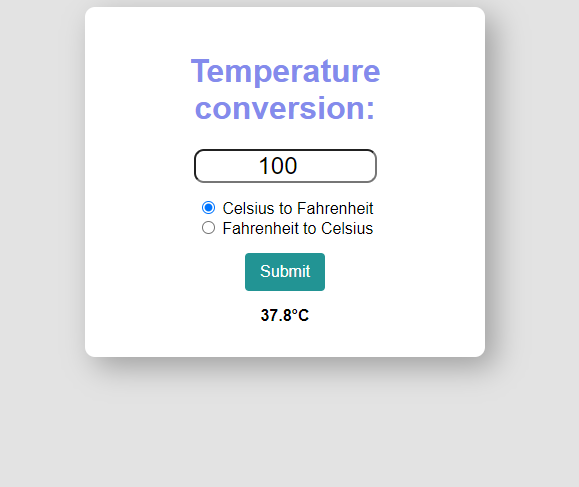

  <h1>Temperature Conversion Program</h1>
    
This program allows users to convert temperatures between Celsius and Fahrenheit using a simple web interface.

  <h2>Features</h2>
    <ul>
        <li>Convert temperatures from Celsius to Fahrenheit</li>
        <li>Convert temperatures from Fahrenheit to Celsius</li>
        <li>Interactive and user-friendly interface</li>
    </ul>
    <h2>How to Use</h2>
    <ol>
        <li>Clone the repository to your local system using the command:
            <pre><code>git clone &lt;[repository-url]: (https://github.com/AhadChanan/Temperature-conversion.git)&gt;</code></pre>
        </li>
        <li>Navigate to the project directory:
            <pre><code>cd temperature-conversion</code></pre>
        </li>
        <li>Open the <code>index.html</code> file in your web browser.</li>
        <li>Enter a temperature value in the input box.</li>
        <li>Select the conversion unit (Celsius to Fahrenheit or Fahrenheit to Celsius).</li>
        <li>Click the "Submit" button to see the converted temperature.</li>
    </ol>

  <h2>Files Included</h2>
    <ul>
        <li><code>index.html</code>: The main HTML file containing the structure of the web page.</li>
        <li><code>style.css</code>: The CSS file for styling the web page.</li>
        <li><code>index.js</code>: The JavaScript file containing the logic for temperature conversion.</li>
    </ul>

  <h2>Example</h2>
    
Below is a snapshot of the Temperature Conversion Program:

    

  <h2>Contributing</h2>
    
Contributions are welcome! Please fork the repository and submit a pull request with your changes.

   <h2>License</h2>
    
This project is open source just dont forgot to give credit.

